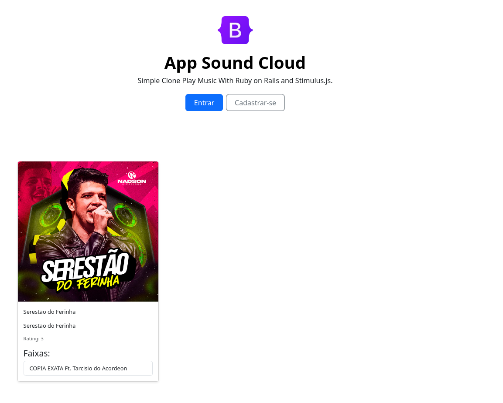

# App Sound Cloud

This README would normally document whatever steps are necessary to get the
application up and running.

Things you may want to cover:

* Ruby version

* System dependencies

* Configuration

* Database creation

* Database initialization

* How to run the test suite

* Services (job queues, cache servers, search engines, etc.)

* Deployment instructions

* ...

Homepage: 


---

Detail play sound page:


---

### Skills

- [Ruby](https://www.ruby-lang.org/)
- [Ruby On Rails](https://rubyonrails.org/)
- [Ruby on Rails Guides](https://guides.rubyonrails.org/)
- [Postgresql](https://www.postgresql.org/)
- [Redis](https://redis.io/)
- [Pagy](https://github.com/ddnexus/pagy)
- [Sidekiq](https://github.com/sidekiq/sidekiq)
- [Rubocop rails](https://github.com/rubocop/rubocop-rails)
- [Hotwired](https://hotwired.dev/)
- [Stimulus JS](https://stimulus.hotwired.dev/)
- [Esbuild](https://esbuild.github.io/)
- [Bootstrap 5](https://getbootstrap.com/)


### Install Ruby and Ruby on Rails
https://gorails.com/setup/ubuntu/22.04


### Run app

```shell
cd app-soundcloud

./bin/dev
#Run in http://localhost:3000 
```
### Test for checks Ruby on Rails applications for security vulnerabilities with brakeman gem
```shell
brakeman
brakeman --help
brakeman -o tmp/output_analysis.html
open tmp/output_analysis.html # open browser

```

### Run all specs in spec directory (excluding plugin specs). Run tests with rspec
```shell
rake spec # or
rails spec
```

### Code Coverage With SimpleCov Gem

#### In a Debian/Ubuntu Terminal you can use this command:
```shell
open coverage/index.html
```

#### In a Mac terminal, you can use this command:
```shell
xdg-open coverage/index.html
```

#### Report code statistics (KLOCs, etc) from the application or engine
```shell
rake stats # or
rails stats

```

https://gilcierweb.com.br